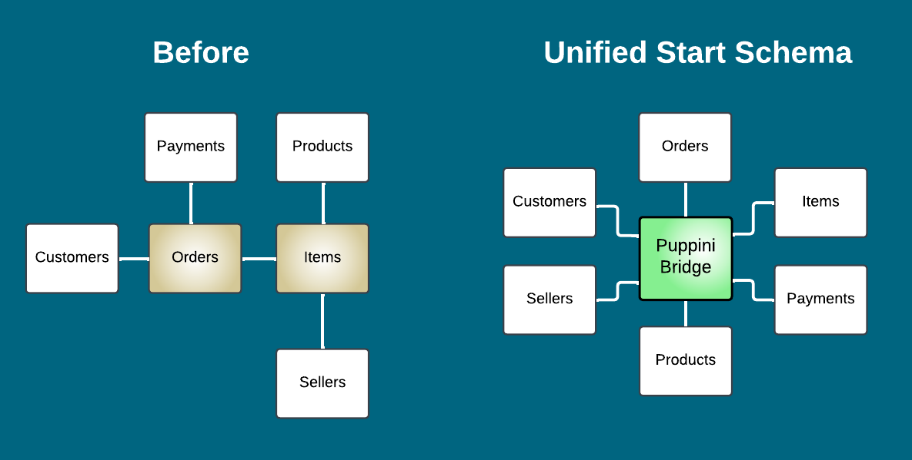
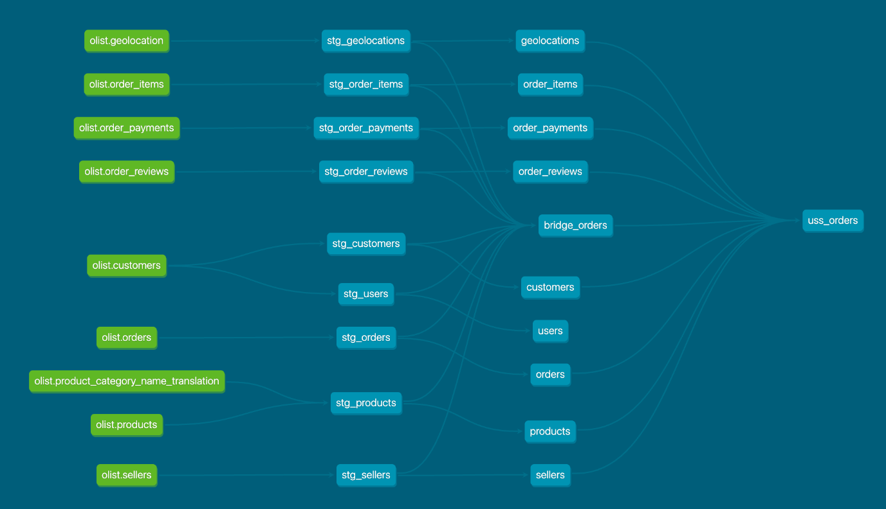
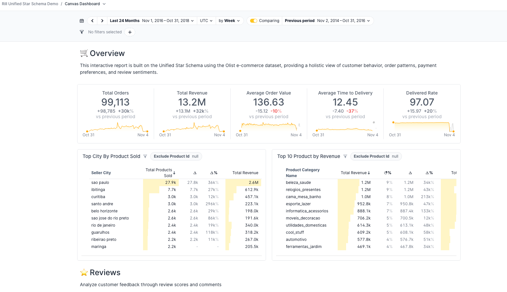

# Unified Star Schema Demo

## What is Unified Star Schema?
The Unified Star Schema (USS), introduced by Bill Inmon and Francesco Puppini in the book [Unified Star Schema: An Agile and Resilient Approach to Data Warehouse and Analytics Design (2020)](https://books.google.de/books/about/The_Unified_Star_Schema_An_Agile_and_Res.html?id=q88AEAAAQBAJ) aims to address key challenges in traditional data modeling:

* **Too many star/snowflake schemas**: Fragmented models make cross-domain analysis complex.<br>
* **Inconsistent dimensions and logic**: Duplicated definitions lead to governance and maintenance issues.<br>
* **Difficult joins and loops**: Navigating snowflake relationships can require complex, error-prone joins.<br>
* **Tight coupling of business logic in marts**: Embedding business-specific requirements into mart design leads to rigid structures that are difficult to adapt as needs change.

## What Are USS Key features?
USS solves these by using a single stable unbiased star schema with a central bridge table, making analytics simpler, more consistent, and easier to scale.

* Central bridge table for simplified, consistent joins
* One-to-many relationships, avoiding circular logic and non-conformed granularity
* Decouples business logic from marts, enabling flexibility and reducing schema obsolescence
* Loop-free design, ensuring safe and clear joins (no chasm trap, fan trap)




> [!TIP]
> A great summary you could find in the article [Unified Star Schema to model Data Products by Paolo Platter](https://www.agilelab.it/blog/unified-star-schema-to-model-data-products).


## Dataset
[Olist](www.olist.com), the largest department store in Brazilian marketplaces, connects small businesses from all over Brazil.

[The dataset](https://www.kaggle.com/datasets/olistbr/brazilian-ecommerce/data) is publicly available on Kaggle.com. Click the link for more context.

## Prerequisites

- Python 3.13
- [uv](https://docs.astral.sh/uv/getting-started/installation/)
- [Rill](https://docs.rilldata.com/home/install)

## Installation

1. Clone the repository and navigate into it:
   ```bash
   git clone https://github.com/Hoanglinh1201/unified-star-schema-demo.git
   cd unified-star-schema-demo
   ```
2. Create and activate a virtual environment using uv
   ```bash
   uv venv
   source .venv/bin/activate
   ```
3. Install the Python dependencies from `uv.lock`:
   ```bash
   uv sync
   ```

4. Prepare the demo database:
   ```bash
   python database_setup.py
   ```
   This downloads the dataset, unzips it and creates `data/olist.duckdb`.

## Quickstart

For a quick demo, run the following commands from the project root:

```bash
uv venv && source .venv/bin/activate
uv sync
python database_setup.py
cd dbt && dbt run
cd ../rill && rill start
```


## DBT
* [`bridge_orders`](dbt/models/mart/bridge_orders.sql) becomes a central switchboard where all keys are stored. Entities connect through the bridge and do not point to others.
* [`uss_orders`](dbt/models/mart/exposure/uss_orders.sql) is basically an implementation of the Bridge for Rill, where entities' attributes are joined to get exposed to the BI layer.
* The connection between two tables is always oriented, eliminating loops



## Rill
* [KPI Dashboard](rill/dashboards/kpi_dashboard.yaml) is built via UI and stored as code.
* [Rill Metric Views](rill/metrics/rill_orders_metrics.yaml) contains all metric definitions.

Once launched, this is the how KPI would look like at http://localhost:9009/canvas/kpi_dashboard



## Repository layout

- `database_setup.py` &ndash; script that downloads and loads the dataset.
- `dbt/` &ndash; dbt project
   - `mart` models represent USS implementation with bridge and final dataset models.
- `rill/` &ndash; example Rill configuration for dashboards and metrics

---
